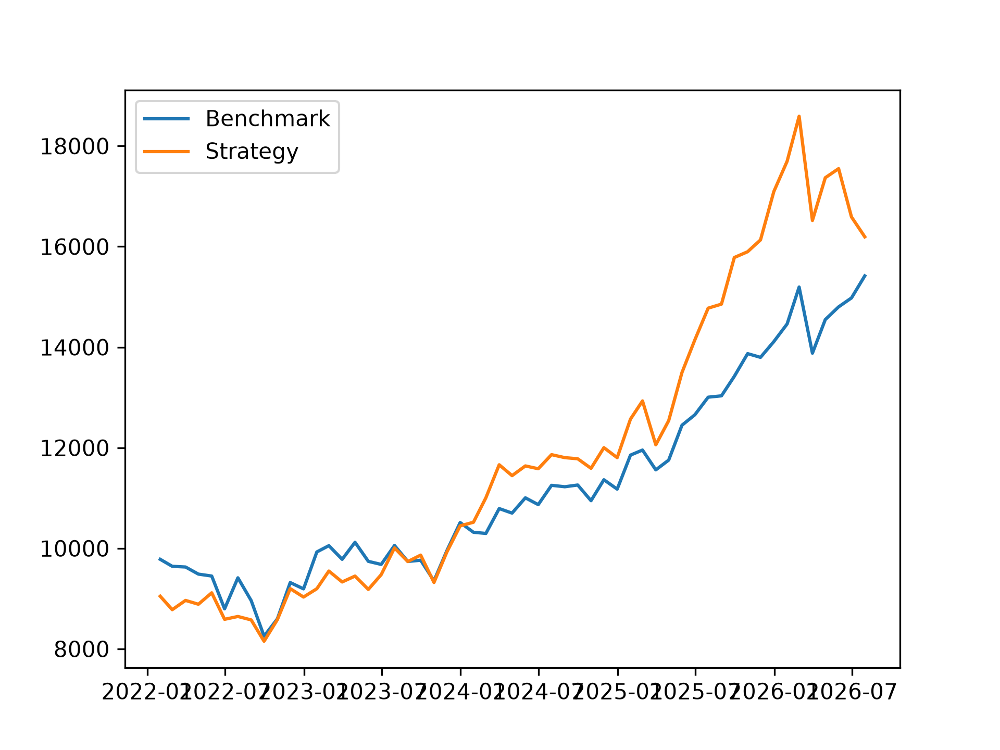

# FTSE 100 Momentum Strategy Backtest
This project looks at backtesting a simple total-return momentum strategy on the current constituents of the FTSE 100 exchange as of *2026/08/01*, and analysing its performance compared to an equal-weighted universe investment strategy. It included a training period on which strategy parameters such as lookback period and the number of stocks invested in were assessed.

### Motivation
As a mathematics student, I'm interested in how areas like the financial sector can use data and quantitative analysis to optimise their strategies and turn data into real-life decision-making. Although this backtest has limitations as stated later in the document, this project was really interesting to build as it has demanded data analysis, programming and some financial knowledge. I hope in the future to build upon these skills and use them to tackle the limitations to make it even more realistic.

## Methodology
### Universe
The universe on which this strategy is used is the FTSE 100 constituents as of *2026/08/01*. The limitation this poses is potential for survivorship bias: we don't face the threat of investing in companies that left the exchange or no longer exist. For a future project, I would like to source an even more complex source of data which can indicate the time of entry and exit from the exchange. To be clear, the data I used was data only pertained from the company whilst it was listed on the London Stock Exchange (LSE).

### Data
The data I used is sourced from Yahoo Finance. By no means is this project intended for trading or investing purposes or advice, it is for informational and exploratory purposes only.

Upon extracting the daily adjusted close prices, using *Pandas* I first resampled the data to reflect the monthly close price for each stock. Then, checking for duplicates, missing values and large swings were vital - this could imply an acquistition or stock split took place and may have to be adjusted for, although this did not occur in the data.

Additionally, after checking for missing values I needed to research the company's history on the exchange and found two particular cases of data that would need to be adjusted. Pershing Square Holdings (PSH) officially entered the LSE on 2 May 2017, but had data during the months of March and April from its listing on the Euronext Amsterdam. I chose to exclude these months as the backtest should only use prices on the LSE.

Secondly, Endeavour Mining plc (EDV) had prices from before its listing on the LSE on 14 June 2021, and therefore prices before this were discarded accordingly.

### Strategy
#### Momentum
The strategy itself is a total-return momentum strategy. Whilst literature states 12-2 month is standard, I wanted to investigate the impact of different lookback periods. This is the number of months in the past we compare prices First had to calculate the momentum for each company, every month. This was done by the calculation: 

$$ 
M_{t} = \frac{p_{t-2}}{p_{t-L}} - 1
$$

where $M_{t}$ denotes the momentum at month $t$, $L$ denotes the lookback period, $p_{t-2}$ denotes the share price at month $t-2$, and $p_{t-L}$ denotes the share price at month $t-L$. This means that we are calculating the change in price over the lookback period, and we omit the most recent 2 months to avoid short-term reversal - over a short time horizon outliers tend to reverse. 

Then, the stocks are ranked by momentum and the top stocks are chosen to invest in. The number of stocks invested in was also a parameter that I wanted to vary, and would test different values during the training period.

#### Signals and Weights
At each rebalancing date, the top $N$ stocks by momentum are selected. This is stored as a binary signal matrix $S$, where each row is a data, and each column is a stock.

$$
S_{t,i} = 
\begin{cases} 1 & \text{if stock} i \text{is in the top} N \text{by momentum} \\ 0 & \text{otherwise} \end{cases}
$$

We equally weighted the investment across the top $N$ stocks, so portfolio weights were stored in a similar matrix $W$ where:

$$
W_{t,i} = \frac{S_{t,i}}{N}
$$

To avoid look-ahead bias, the weights computed at month $t$ are applied to returns in the following month, so that the portfolio only ever trades on information available at the time

#### Transaction Costs
In a momentum strategy, portfolio turnover is high so it was important to implement transaction costs to retain realism.

Research informed the decision to place a 5bps SDRT on purchases, with no transaction tax for sales as of HMRC.

Turnover was calculated for month $t$ as the sum of the absolute differences between row $t$ and row $t-1$ of the signal matrix. The number of purchases is exactly half the turnover, with the exception of the first month of trading where a tax is applied to all $N$ purchases.

### Backtest
For the backtest, I wanted to include a training period and an, out-of-sample, testing period. This meant that I could analyse the results of the strategy with different parameters over the training period, and choose parameters that performed well in order to trade in the testing period.

It was important that overfitting did not occur, once parameters were chosen for the testing period they were final.

The training period occurred from *2015-01-01* to *2021-12-31* trading only from *2016-02-29* as 12 months of price data was required for the largest lookback period.

Each month, portfolio returns is the product of the sum of the lagged weights and the month's stock returns. Transaction costs are then deducted to give net porfolio returns.

Over the training period, all combinations of lookback period (3, 6, 9, 12 months) and portfolio size ( 10, 15, 20,25) stocks were evaluated. The chosen parameters (9-2 lookback, 20 stocks) were chosen according to three metrics.

### Metrics
Strategies were evaluted using three metrics calculated from monthly returns:

**Sharpe ratio**: mean monthly return of the portfolio $R_p$ divided by its standard deviation $\delta_p$. A risk free rate of 0% was assumed meaning it was calculated by:

$$
S = \frac{R_p}{\delta_p}
$$

**Annualised return**: the compound yearly return over the period calculated by

$$
R_{\text{ann}} = \left( \prod_{t=1}^{T} (1 + r_t) \right)^{\frac{12}{T}} - 1
$$

where $r_t$ is the net return in month $t$ and $T$ is the number of months in the period

**Maximum Drawdown**: largest peak-to-trough fall in porfolio value over the period. It is calculted by tracking the cumulative porfolio value and its running peak, and computing drawdown at each month from this peak. The most negative drawdown is thus chosen.

These three metrics were then used to evaluate the 9-2 month momentum strategy, and the benchmark, with the results shown here as an equity curve, and the metrics.

| Metric            | Strategy | Benchmark |
|-------------------|----------|-----------|
| Sharpe Ratio      | 0.786    | 0.779     |
| Annualised Return | 11.1%    | 9.9%      |
| Maximum Drawdown  | -12.9%   | -15.6%    |

### Results

Over the test period, the strategy matched the benchmark on risk-adjusted return (Sharpe of 0.786 vs 0.779), and modestly bested it on annualised return (11.1% vs 9.9%).

We can observe a greater disparity in maximum drawdown, and this suggests that the strategy may have helped the portfolio to avoid some of the weakest stocks.

However, due to the short time horizon of the backtest, with only 55 monthly observations, we cannot say for certain the strategy adds value.

Curiously, other combinations of strategy parameters performed much better than 9-2, 20 on the testing period, with most combinations exceeding a Sharpe ratio of 1. 

This is a reminder of how easily noise can be mistaken for a genuine edge, and in future projects I'd like to include statistical tests to distinguish signal from noise.

